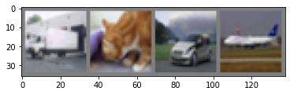

#### Introduction and Objective

Our objective is to make a neural network model, which can correctly classify a given image into one of the 10 given classes of the CIFAR-10 dataset. We are using PyTorch library to make our model. 

**Convolution Neural Network (CNN)** are a feed-forward type of deep learning neural network. They are used to classify the data and are extensively used in making image classifiers, computer vision and video processing, audio and speech analysis, etc. The main difference in CNN and other matrix multiplication based neural networks is that a CNN uses *convolutions* in at least one layer of the neural network, i.e. takes it takes two functions and returns a function instead of using matrix multiplications, which become exponentially complex as the size of the data increases.

**CIFAR-10** dataset is a collection of 60000 32x32 labeled images divided into 10 classes, airplanes, cars, birds, cats, deer, dogs, frogs, horses, ships, and trucks, having 6000 images in each class. This dataset is one of the most commonly used dataset for making machine learning image classification algorithms and models. We would use this dataset for making our model. The dataset can be downloaded from the kaggle link provided in the links below.

**PyTorch** is an open-source machine learning library created by Facebook. It can be used for various applications such as natural language and audio/speech processing, computer vision etc. Another similar library is TensorFlow. In this project we are going to use PyTorch.

We would take the help of [PyTorch CIFAR-10 tutorial](<1. https://pytorch.org/tutorials/beginner/blitz/cifar10_tutorial.html#sphx-glr-beginner-blitz-cifar10-tutorial-py>) for making the classifier and try to make improvements on it.

#### Process

First we would have to import the torch package and download and load the data.

```
import torch
import torchvision
import torchvision.transforms as transforms
```

After downloading and uploading the CIFAR-10 data images, we then divide the dataset into train and test sets.

```
transform = transforms.Compose(
    [transforms.ToTensor(),
     transforms.Normalize((0.5, 0.5, 0.5), (0.5, 0.5, 0.5))])

batch_size = 4

trainset = torchvision.datasets.CIFAR10(root='./data', train=True,
                                        download=True, transform=transform)
trainloader = torch.utils.data.DataLoader(trainset, batch_size=batch_size,
                                          shuffle=True, num_workers=2)

testset = torchvision.datasets.CIFAR10(root='./data', train=False,
                                       download=True, transform=transform)
testloader = torch.utils.data.DataLoader(testset, batch_size=batch_size,
                                         shuffle=False, num_workers=2)

classes = ('plane', 'car', 'bird', 'cat',
           'deer', 'dog', 'frog', 'horse', 'ship', 'truck')
```

We get the following output

```
Downloading https://www.cs.toronto.edu/~kriz/cifar-10-python.tar.gz to ./data/cifar-10-python.tar.gz
Extracting ./data/cifar-10-python.tar.gz to ./data
Files already downloaded and verified
```

```
Files already downloaded and verified
Files already downloaded and verified
```

We can now test to see some of the images we downloaded.

```
import matplotlib.pyplot as plt
import numpy as np

def imshow(img):
    img = img / 2 + 0.5 
    npimg = img.numpy()
    plt.imshow(np.transpose(npimg, (1, 2, 0)))
    plt.show()

dataiter = iter(trainloader)
images, labels = dataiter.next()

imshow(torchvision.utils.make_grid(images))
print(' '.join('%5s' % classes[labels[j]] for j in range(batch_size)))
```

We get the following random images



We also get their classes.

```
truck   cat   car plane
```


###### Making our Neural Network

Now after testing the downloaded images, we can get to making our Convolutional Neural Network. We are going to use Classification Cross-Entropy loss for our function.

```
import torch.nn as nn
import torch.nn.functional as F


class Net(nn.Module):
    def __init__(self):
        super().__init__()
        self.conv1 = nn.Conv2d(3, 6, 5)
        self.pool = nn.MaxPool2d(2, 2)
        self.conv2 = nn.Conv2d(6, 16, 5)
        self.fc1 = nn.Linear(16 * 5 * 5, 120)
        self.fc2 = nn.Linear(120, 84)
        self.fc3 = nn.Linear(84, 10)

    def forward(self, x):
        x = self.pool(F.relu(self.conv1(x)))
        x = self.pool(F.relu(self.conv2(x)))
        x = torch.flatten(x, 1) # flatten all dimensions except batch
        x = F.relu(self.fc1(x))
        x = F.relu(self.fc2(x))
        x = self.fc3(x)
        return x


net = Net()
```

```
import torch.optim as optim

criterion = nn.CrossEntropyLoss()
optimizer = optim.SGD(net.parameters(), lr=0.001, momentum=0.9)
```


We can now start training our network.

```
for epoch in range(2):  # loop over the dataset multiple times

    running_loss = 0.0
    for i, data in enumerate(trainloader, 0):
        # get the inputs; data is a list of [inputs, labels]
        inputs, labels = data

        # zero the parameter gradients
        optimizer.zero_grad()

        # forward + backward + optimize
        outputs = net(inputs)
        loss = criterion(outputs, labels)
        loss.backward()
        optimizer.step()

        # print statistics
        running_loss += loss.item()
        if i % 2000 == 1999:    # print every 2000 mini-batches
            print('[%d, %5d] loss: %.3f' %
                  (epoch + 1, i + 1, running_loss / 2000))
            running_loss = 0.0

print('Finished Training')
```

We get the following output.

```
[1,  2000] loss: 2.208
[1,  4000] loss: 1.867
[1,  6000] loss: 1.694
[1,  8000] loss: 1.575
[1, 10000] loss: 1.529
[1, 12000] loss: 1.481
[2,  2000] loss: 1.399
[2,  4000] loss: 1.373
[2,  6000] loss: 1.353
[2,  8000] loss: 1.330
[2, 10000] loss: 1.319
[2, 12000] loss: 1.274
Finished Training
```

#### Links

1. [CIFAR-10 Dataset](https://www.kaggle.com/c/cifar-10/data)
2. [Our Jupyter Notebook with code](https://github.com/skbt/CIFAR-10-classfier/blob/main/DataMining_Assignment1-CIFAR-10_Classifier.ipynb)

#### References

1. https://pytorch.org/tutorials/beginner/blitz/cifar10_tutorial.html#sphx-glr-beginner-blitz-cifar10-tutorial-py
2. https://www.kaggle.com/c/cifar-10
3. https://deepai.org/machine-learning-glossary-and-terms/convolutional-neural-network
4. https://en.wikipedia.org/wiki/CIFAR-10
5. https://www.ibm.com/cloud/learn/convolutional-neural-networks
6. https://en.wikipedia.org/wiki/Convolutional_neural_network
7. https://en.wikipedia.org/wiki/PyTorch