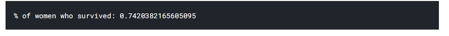
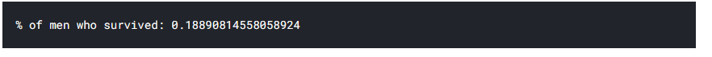
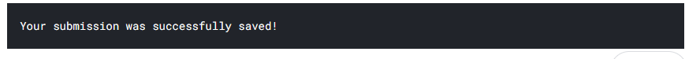
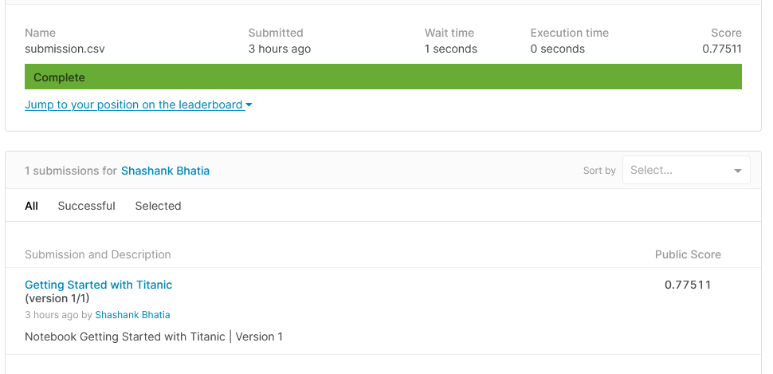

**[Kaggle](https://www.kaggle.com/)** on [wikipedia](https://en.wikipedia.org/wiki/Kaggle) is defined as ".... is an online community of data scientists and machine learning practitioners.... allows users to find and publish data sets, explore and build models in a web-based data-science environment, work with other data scientists and machine learning engineers, and enter competitions to solve data science challenges." Kaggle is collaborative platform of where we can learn and practice data-science and machine learning.

It is very beginner friendly and even has a tutorial set to learn about machine learning.

###### The Titanic Problem

The sinking of "unsinkable" Titanic ship was one of the most infamous shipwrecks in history. Our [task](https://www.kaggle.com/c/titanic/) is to create a predictive model which can predict what sort of people were more likely to survive shipwreak based on their various socio-economic and personal data (e.g. Are women more likely to survive compared to men? Are rich people more likely to survive compared to men? etc.)

###### Data

We have been given two two similar datasets on the [data tab of Kaggle](https://www.kaggle.com/c/titanic/data) that include passenger information like name, age, gender, socio-economic class, etc. We will use the first one - called "Train.csv" to find patterns and establish the “ground truth” - whether passengers survived or not.

The second one - called  "test.csv" dataset contains similar information but does not disclose whether passengers survived or not.

If we are using [Alexis Cook’s Titanic Tutorial](https://www.kaggle.com/alexisbcook/titanic-tutorial), it also has the gender segregated data of passengers who died called "gender_submission.csv"

###### Objective

We are going to make a model to predict whether the passengers in "test.csv" dataset survive or not using the patterns we find in "train.csv". We are then going submit the result to the kaggle competition. Our objective is get the best possible score.

###### Requirements

We are going to use python3 with numpy and pandas libraries to make our model. We may use IPython too. However, as we are using Kaggle, we don't *have* to download or install anything.

###### Step 1 - Input the files

Import "train.csv" and "test.csv" files. We can print the path of files so we know where the path of file is stored so we load the files into the notebook

```
import numpy as np
import pandas as pd

import os

for dirname, _, filenames in os.walk('/kaggle/input'):
    for filename in filenames:
        print(os.path.join(dirname, filename))
```

Output

```
/kaggle/input/titanic/train.csv
/kaggle/input/titanic/test.csv
/kaggle/input/titanic/gender_submission.csv
```

Step 2 - Load the data from file

We have to load the data from "train.csv" file for training. 

```
train_data = pd.read_csv("/kaggle/input/titanic/train.csv")
train_data.head()
```

Output


We do the similar for "test.csv"

```
test_data = pd.read_csv("/kaggle/input/titanic/test.csv")
test_data.head()
```

Output


###### Step 3 : Making a hypothesis and making the submission after testing and training the data

Now that we have loaded the data into our notebook, we can make a model for predicting. We make a *[hypothesis](https://en.wikipedia.org/wiki/Hypothesis)* that all the women survived the disaster and all the men died. We have the data of passengers who actually died in "gender_submission.csv".

We can display the percent of women died using

```
women = train_data.loc[train_data.Sex == 'female']["Survived"]
rate_women = sum(women)/len(women)

print("% of women who survived:", rate_women
```

Output



Similarly for men

```
men = train_data.loc[train_data.Sex == 'male']["Survived"]
rate_men = sum(men)/len(men)

print("% of men who survived:", rate_men
```

Output



We can see that the actual percentage of women passengers (in **train.csv**) who survived almost 74% women, while only about 18% of the men survived.

Here, we only used a single column to predict data. In real world we use multiple columns to predict data.

###### Making Random Forest machine learning model

Our previous test was based only on one column. To make model which can discover complex relationships, we can make use of multiple columns. We will use what is known as random forest model. Here, each "tree" will be a single passenger's data and it would take the columns "Pclass", "Sex", "SibSp", and "Parch", where they represent Passenger class, Sex of passenger, if they Siblings or Spouse abroad, Number of Parent/children abroad respectively, of the data to make the decision. This model would individually consider each passenger's data and vote on whether the individual survived. It would take the data from train.csv file, generate predictions for the passengers in test.csv and then save the predictions in a submission.csv file.

```
from sklearn.ensemble import RandomForestClassifier

y = train_data["Survived"]

features = ["Pclass", "Sex", "SibSp", "Parch"]
X = pd.get_dummies(train_data[features])
X_test = pd.get_dummies(test_data[features])

model = RandomForestClassifier(n_estimators=100, max_depth=5, random_state=1)
model.fit(X, y)
predictions = model.predict(X_test)

output = pd.DataFrame({'PassengerId': test_data.PassengerId, 'Survived': predictions})
output.to_csv('submission.csv', index=False)
print("Your submission was successfully saved!")
```

Output



We would also get a file "submission.csv" which we upload to the competition for which we would be graded.



We got the score of **0.77511** for our model.

###### Link

The link to the kaggle notebook can be found at:

<https://www.kaggle.com/shashankrbhatia/getting-started-with-titanic>


###### Reference

https://www.kaggle.com/alexisbcook/titanic-tutorial