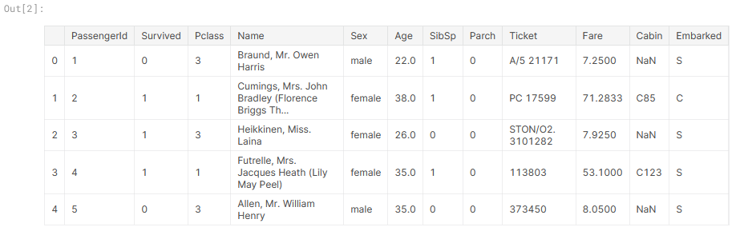

**[Kaggle](https://www.kaggle.com/)** on [wikipedia](https://en.wikipedia.org/wiki/Kaggle) is defined as ".... is an online community of data scientists and machine learning practitioners.... allows users to find and publish data sets, explore and build models in a web-based data-science environment, work with other data scientists and machine learning engineers, and enter competitions to solve data science challenges." Kaggle is collaborative platform of where we can learn and practice data-science and machine learning.

It is very beginner friendly and even has a tutorial set to learn about machine learning.

###### The Titanic Problem

The sinking of "unsinkable" Titanic ship was one of the most infamous shipwrecks in history. Our [task](https://www.kaggle.com/c/titanic/) is to create a predictive model which can predict what sort of people were more likely to survive shipwreak based on their various socio-economic and personal data (e.g. Are women more likely to survive compared to men? Are rich people more likely to survive compared to men? etc.)

###### Data

We have been given two two similar datasets on the [data tab of Kaggle](https://www.kaggle.com/c/titanic/data) that include passenger information like name, age, gender, socio-economic class, etc. We will use the first one - called "Train.csv" to find patterns and establish the “ground truth” - whether passengers survived or not.

The second one - called  "test.csv" dataset contains similar information but does not disclose whether passengers survived or not.

If we are using [Alexis Cook’s Titanic Tutorial](https://www.kaggle.com/alexisbcook/titanic-tutorial), it also has the gender segregated data of passengers who died called "gender_submission.csv"

###### Objective

We are going to make a model to predict whether the passengers in "test.csv" dataset survive or not using the patterns we find in "train.csv". We are then going submit the result to the kaggle competition. Our objective is get the best possible score.

###### Requirements

We are going to use python3 with numpy and pandas libraries to make our model. We may use IPython too. However, as we are using Kaggle, we don't *have* to download or install anything.

###### Step 1 - Input the files

Import "train.csv" and "test.csv" files. We can print the path of files so we know where the path of file is stored so we load the files into the notebook

```
import numpy as np
import pandas as pd

import os

for dirname, _, filenames in os.walk('/kaggle/input'):
    for filename in filenames:
        print(os.path.join(dirname, filename))
```

Output

```
/kaggle/input/titanic/train.csv
/kaggle/input/titanic/test.csv
/kaggle/input/titanic/gender_submission.csv
```

Step 2 - Load the data from file

We have to load the data from "train.csv" file for training. 

```
train_data = pd.read_csv("/kaggle/input/titanic/train.csv")
train_data.head()
```

Output



We do the similar for "test.csv"

```
test_data = pd.read_csv("/kaggle/input/titanic/test.csv")
test_data.head()
```

Output


###### Step 3 : Making a hypothesis and making the submission after testing and training the data