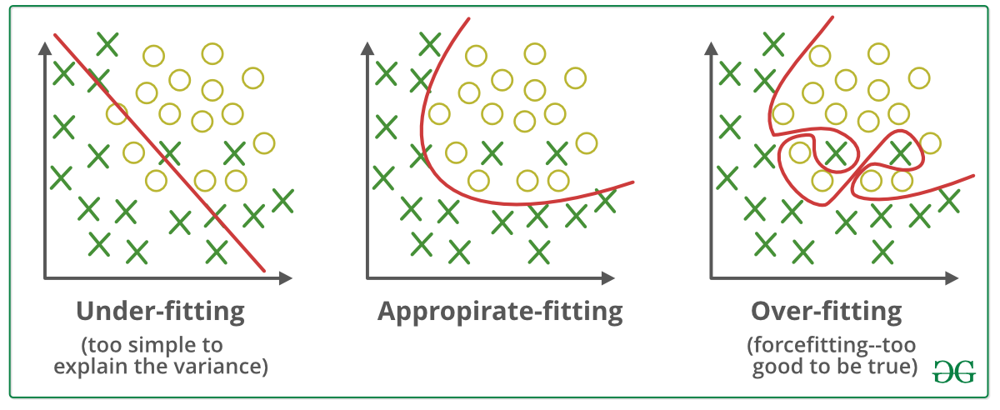

#### Introduction and Objective

Our goal is explore and explain the concepts of model overfitting and underfitting using Higher Order Linear Regression. We are going to use Python modules PyTorch, NumPy and matplotlib to make and plot the results of our model. We would generate the data, divide it into train and test datasets, and then analyze it. The detailed problem statement can be found on the [Google Doc](https://docs.google.com/document/d/126p_RE60XSdpzmNWmO-OUOGsUbR-LczyYDQ9I4xnYAQ/edit#) by made my professor, [Dr. Deokgun Park](https://crystal.uta.edu/~park/), for the class CSE 5331 Data Mining. 

**Overfitting** is said to occur when a model corresponds very closely to training data set and usually contains more parameters than required by the data. The model generated works very well against training data and has a very high accuracy against it but not very accurate against any other unseen data. We can improve the model accuracy by *decreasing* the complexity of the model.



[Image Source](https://www.geeksforgeeks.org/underfitting-and-overfitting-in-machine-learning/)

**Underfitting** is the opposite of Overfitting as the name suggests. It occurs when the model is too simple. The model generated is unable to capture the relationship between input and output variables accurately and has a high error rate for both training and test dataset. Its accuracy can be improved by making the model *more complex*.


#### Process

First, we import the required libraries.

```
import numpy as np
import torch
from torch.autograd import Variable
import matplotlib.pyplot as plt
```


###### a. Generate 20 data pairs (X, Y) using y = sin(2\*pi\*X) + 0.1 * N


#### Links

1. [Our Jupyter Notebook with Code](https://github.com/skbt/Overfitting-in-polynomial-regression/blob/main/Overfitting-using-Higher-Order-Linear-Regression.ipynb)

#### References

1. https://www.pythonpool.com/matplotlib-table/

2. https://datascience.stackexchange.com/questions/80868/overfitting-in-linear-regression

3. https://en.wikipedia.org/wiki/Overfitting

4. https://www.ibm.com/cloud/learn/overfitting

5. https://www.geeksforgeeks.org/underfitting-and-overfitting-in-machine-learning/

6. https://www.ibm.com/cloud/learn/underfitting

7. https://www.geeksforgeeks.org/polynomial-regression-from-scratch-using-python/